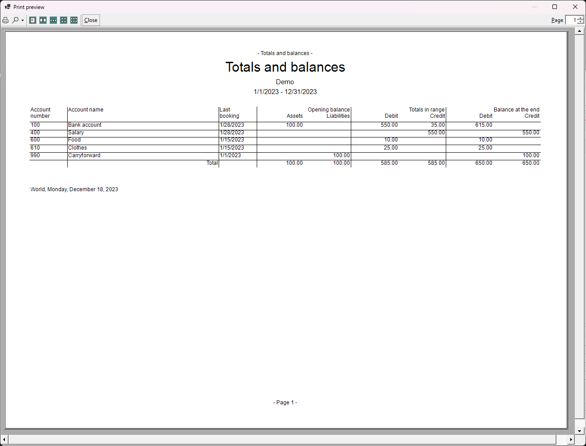

# SimpleAccounting - Simple Accounting Software

I started `SimpleAccounting` around 2005, only for my personal use to manage accounts and balances of a small club.
In 2019, I met a colleague from another small club who was looking for a simple solution to get an overview of the balances of several logical and real accounts.

So I decided to rework my solution to make it usable for others and open source.

## Naming

The name says it all. The software is as simple as possible. 

It probably does not follow all rules and laws of double-entry accounting, e.g. the software does not protect accounting entries from changes.
The data is stored in readable XML format and can be changed manually.

The software focuses on journal and balance sheet reporting.

## Features

* Data management for double-entry accounting, stored as XML (see [example](./samples/sample.bxml)) and defined using [XSD](./docs/AccountingData.xsd)
* User interface for the management of accounts, the creation of entries, the listing of account journals
* Import of booking entries from CSV files incl. semi-automatic assignment of offsetting accounts
* Printable reports for full journal, account journal, accounts and balances, and annual financial statements

Some screenshots for first impression:

|Main view|Totals and balances report|
|-|-|
|||

## Contribution

Contributions are welcome!

Small changes can be made immediately via Pull Request. I will try to check and integrate it as soon as possible.
Medium and large changes should be discussed first. Please open a new issue or participate in existing discussions.

## TODOs

When I started the project in 2005, I saw no relevance for unit testing.
So far the test coverage is not yet good:

With the decision last year to publish it, I started to switch to Test Driven Development.
I hope to increase coverage step by step. Maybe you want to help by creating component tests?

I am German and have no experience with English names for the financial world.
So I'm pretty sure that some of the words I use are confusing for native speakers.
Maybe you want to help with the better naming?

Also, the user interface is completely in German.
Maybe you want to help with the introduction of a localized user interface?

## Roadmap

The first public release is [available](https://github.com/lg2de/SimpleAccounting/releases).
Please download, test and send feedback.

After release of first non-beta version I'll create future roadmap.

## License

I do not like closed source reuse of my software.
This is why I decided to license the software under GPLV3.
